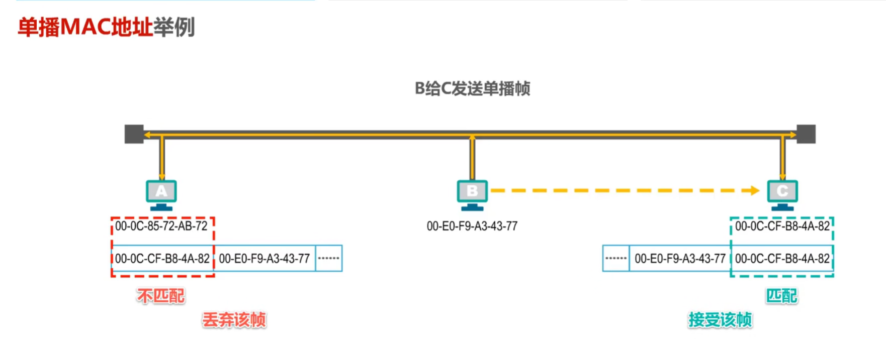

# 提纲

有工程认证，所以有计算题，应用题，分析题为主。

王道考研复习题408计网复习指南。

讲述题目：

1.名词解释

2.优缺点

3.应用场景

# 第一节课

老师不知道是A卷还是B卷

**DNS**的原理和画图，递归和迭代

IP老是变，买固定IP，就花很多钱。可以用花生壳这个软件让所有人可以获取你的域名。

**FTP**的工作原理和画图

>  扩展：FTP与TFTP的比较？

Telnet只需要对方的IP地址就可以远程连接

SMTP邮件传输。（电子邮件传输）

> 扩展：
>
> 最常见：Foxmail, Outlook
>
> 用TCP协议
>
> 用户代理：
>
> 拉取：POP3

四个配置才能上网：

>IP
>
>掩码
>
>默认网关:ARP
>
>DNS:获取域名
>
>DHCP:自动获取IP地址

搜索王道！！！！

# 第二节课

## 1.物理层:

数字信号,模拟信号

物理接口，数据，信号

复用:时分、。。。：TDM, FDM, CDMA(重点)

**CDMA习题必考**。（课本的习题，计算题）

设备：集线器，中继器

## 2.数据链路层

把bit变成数据帧

为了解决数据冲突问题，就有：

流量控制（滑动窗口）

**差错控制**（CRC校验， 二进制除法， 计算题）

给一个接收方的数据，先判断有没有错，没错就要还原发送方的数据。

以太网

CAMA/CD协议（广播域， 冲突域）

VLAN的特点

设备：交换机（1.地址学习 或者 自学习， **用来建立mac和端口之间的关系**，

2. **转发和过滤**

3. 生成树）

   A向B发送数据，交换机应用，工作原理

   

## 3.网络层

①IP地址

子网划分（均匀的，**非均匀**的）、

**必考**（录音的第4点）必须会非均匀的。

②路由转发

录音5前面

③如何生成路由表

拓扑图画简单的路由表

④图表的互相转换

拓扑图和路由表相互转化

必考（录音6）

⑤NAT地址转换

DHCP功能

⑥ARP协议：解决iP地址和mac地址的关系

直接交付和间接交付：
画图：AB通信，AX通信（把默认网关的mac地址当成X的mac地址）（7前面）

## 四、传输层

TCP/UDP

不考TCP拥塞

5-10到15

## 五、应用层

①DNS必考！迭代和递归

②FTP的工作过程

③FTP与TFTP的比较

总结：

录音：第10（TDDO）

计算题：

CDMA

CRC

交换机 转发和过滤

IP地址

路由转发

生成路由表

图表

子网划分

NAT

# 复习得出的真正考点

## 1.物理层

### 1.1 考点

数字信号,模拟信号

物理接口，数据，信号

复用:时分、。。。：TDM, FDM, CDMA(重点)

**CDMA习题必考**。（课本的习题，计算题）

设备：集线器，中继器

### 1.2 自己的理解

物理层的任务其实就是：

>  怎么样才能在连接各种计算机的传输媒体上传输数据比特流?

物理层规程,也是物理层协议,主要关注4个方面:

1. 机械特性:
2. 电气特性
3. 功能特性
4. 过程特性

传播数据比特流, 当然会有传输方式.

我们可以用三种分类方式:

1.串行传输和并行传输

2.同步传输和异步传输

3.单向通信, 双向交替通信(半双工), 双向同时通信(全双工)

在同步传输时,为了保持同步传输,  可以采用

外同步: 添加同步线(这个我不太了解)

内同步:就是编码.(曼彻斯特编码)

A1和A2传输数据比特流要一个信道;

B1和B2传输数据比特流要一个信道;

C1和C2传输数据比特流要一个信道.

信道复用技术可以帮助多个数据流在同一信道上进行传输，以提高带宽利用率。在你的例子中，A1、B1和C1需要传输的数据比特流可以通过复用技术合并在一个信道上进行传输，这样就能够有效地共享资源。

**码分复用**(Code Division Multiplexing)是重点. 人们更常用的名词是 CDMA.

电脑A与电脑B之间的数据传输过程：

1. 文本信息的表示：在电脑A中，文本信息会首先被转换为二进制数据表示。这是因为计算机处理和存储数据时使用的是二进制系统，将文本信息转换为二进制数据可以使计算机更好地处理和传输。(消息->数据)
2. 网卡与信号转换：一旦文本信息被转换为二进制数据，在进行网络通信时，这些数据将通过电脑A的网卡（网络接口卡）发送出去。网卡将二进制数据转换为适合在物理媒介上传输的信号。这些信号通常使用调制技术将数字信号转换为模拟信号。(数据->信号)
3. 数字基带信号：信号从网卡输出后，会经过物理媒介（例如网线）传输到电脑B所在的位置。在传输过程中，信号会以数字基带信号的形式存在。数字基带信号是一种表示原始数字比特流的信号，没有经过调制和编码。(信号->基带信号)
4. 编码与数字比特流传输：在传输过程中，为了提高传输可靠性和抵抗干扰，数字基带信号可能会经过编码处理。编码技术可以将数字信号转换为数字比特流，其中每个比特表示一个二进制位。这些数字比特流在数字信道中进行传输。(基带信号->数字比特流)

### 1.3 课后习题

P68  2-16

P67 2-13 为什么要使用信道复用技术?常见的信道复用技术有哪些?

> 信道复用技术主要是为了有效地利用有限的通信资源，实现多个信号或数据流在同一个信道上进行传输。通过信道复用技术，可以提高通信系统的带宽利用率、提升传输效率，并支持多个用户或设备同时进行通信。
>
> 1. 时分复用（Time Division Multiplexing，TDM）：将时间分割成若干个时隙，每个时隙用于传输一个信号或数据流，多个信号依次轮流占用信道进行传输。
> 2. 频分复用（Frequency Division Multiplexing，FDM）：将频谱分割成不同的频带，每个频带用于传输一个信号或数据流，不同频带的信号并行传输在同一个信道上。
> 3. 波分复用（Wavelength Division Multiplexing，WDM）：在光纤通信中采用的一种复用技术，通过利用不同波长的光信号在同一根光纤中进行传输。
> 4. 码分复用（Code Division Multiplexing，CDM）：采用不同的编码方案，使得不同信号或数据流在频域上相互独立，通过在同一频带上同时传输实现复用。

## 2. 数据链路层

### 2.1 考点

把bit变成数据帧

为了解决数据冲突问题，就有：

流量控制（滑动窗口）

**差错控制**（CRC校验， 二进制除法， 计算题）

给一个接收方的数据，先判断有没有错，没错就要还原发送方的数据。

以太网

CAMA/CD协议（广播域， 冲突域）

VLAN的特点

设备：交换机（1.地址学习 或者 自学习， **用来建立mac和端口之间的关系**，

2. **转发和过滤**

3. 生成树）

   A向B发送数据，交换机应用，工作原理

   

### 2.2 自己的理解

数据链路层的三个重要问题：

1.封装成帧

其实就是在数据添加帧头和帧尾

2.差错检测

在帧尾写入检测码，来判断数据是否误码

3.可靠传输

发送端发送什么，接收端就接受什么，这就是可靠传输。

如果数据误码后直接丢弃，不做其他处理，那么就是不可靠传输。

差错检测：**CRC**循环冗余检验的计算题。

可靠传输的一些协议：

**回退N帧协议（滑动窗口）**；（GBN）

如果主体在总线上同时发送数据，肯定会发生数据碰撞。为了避免数据碰撞，要引入媒体接入控制：

静态划分信道：FDM,TDM,WDM,**CDM(A)**

动态划分信道：**CSMA/CD**

MAC地址，IP地址，APR协议：

MAC地址：

IP的例子：在发送数据包的时候，IP目的地址和源地址始终保持不变，但是MAC地址是变的。

APR协议：	通过IP地址找MAC地址。注意：广播域里才成立。而路由器隔离广播域。

集线器既不隔离冲突域，也不隔离广播域；

交换机隔离冲突域，但不隔离广播域；

路由器既隔离冲突域，也隔离广播域。

设备：交换机（1.地址学习 或者 自学习， **用来建立mac和端口之间的关系**，

?:交换机的帧转发表是根据接收到的数据帧中的源MAC地址来学习的。所以,B发给C,帧转发表只会记录B的MAC地址与端口号对应关系,不会记录C的MAC地址和端口号对应关系.

2. **转发和过滤**

3. 生成树）

   A向B发送数据，交换机应用，工作原理

VLAN 作用:将较大的广播域分割成较小的广播域.

### 2.3 课后习题

## 3. 网络层

#### 3.1 考点

①IP地址

子网划分（均匀的，**非均匀**的）、

**必考**（录音的第4点）必须会非均匀的。

②路由转发

录音5前面

③如何生成路由表

拓扑图画简单的路由表

④图表的互相转换

拓扑图和路由表相互转化

必考（录音6）

⑤NAT地址转换

DHCP功能

⑥ARP协议：解决iP地址和mac地址的关系

直接交付和间接交付：
画图：AB通信，AX通信（把默认网关的mac地址当成X的mac地址）（7前面）

#### 3.2 自己的理解

IPV4编制的阶段:

子网划分

CIDR划分， 路由聚合

①IPV4子网划分：定长子网掩码；**变长子网掩码**

②路由转发③④

⑤NAT?

DCHP协议：自动从服务器动态获取IP地址，子网掩码，默认网关，DNS服务器名称与IP地址。

⑥ARP协议（IP地址-》mac地址）

#### 3.3 课后习题

①P220 4-54

## 4. 运输层

#### 4.1 考点

TCP/UDP

不考TCP拥塞

5-10到15

#### 4.2 自己的理解

UDP面向报文

TCP面向字节流

#### 4.3 课后习题

##### 5-10

试说明运输层中伪首部的作用

UDP首部格式为8B。其中有2B是用来检验整个UDP的首部和数据报是否出错。

伪首部的作用是：用于校验UDP的首部和数据包是否出现差错。、

> 伪首部的作用是在传输层的TCP和UDP报文前面增加一部分字段，用于计算检验和。它包含了源IP地址、目的IP地址、协议号和报文长度等信息，通过对伪首部和报文数据进行校验和的计算，可以验证数据在传输过程中是否发生了改变。

##### 5-11

用户数据包UDP提供了哪些IP没有提供的功能？

UDP提供对应用进程的复用和分用功能,并提供对数据部分的差错检验.

而IP数据报只能找到谜底主机而无法找到目的进程.

复用分用：

差错检测：

#### 5-12

一个应用程序用UDP，到了IP 层把数据报再划分为4个数据报片发送出去。结果前两个数据报片丢失，后两个到达目的站。过了一段时间应用程序重传UDP，而IP层仍然划分为4个数据报片来传送。结果这次前两个到达目的站而后两个丢失。试问：在目的站能否将这两次传输的4个数据报片组装成为完整的数据报？假定目的站第一次收到的后两个数据报片仍然保存在目的站的缓存中。

> 不行,重传时,IP数据包的标识字段会有另外一个标识符.标识符相同的IP数据报片才能组成一个IP数据报.

#### 5-13

一个UDP用户数据报的数据字段为8192字节。在链路层要使用以太网来传送。试问应当划分为几个IP数据报片？说明每一个IP数据报片的数据字段长度和片偏移字段的值。

> 

#### 5-14

一个 UDP用户数据报的首部的十六进制表示是：06320045 001CE217。试求源端口、目的端口、用户数据报的总长度、数据部分长度。这个用户数据报是从客户发送给服务器还是从服务器发送给客户？使用UDP的这个服务器程序是什么？

> 

#### 5-15

使用 TCP对实时话音数据的传输会有什么问题？使用UDP在传送数据文件时会有什么问题？

## 5. 应用层

①DNS必考！迭代和递归

②FTP的工作过程

③FTP与TFTP的比较

### 5.2 自己的理解
